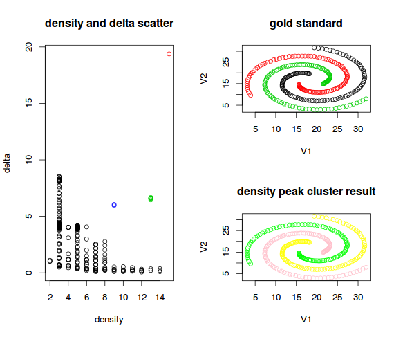
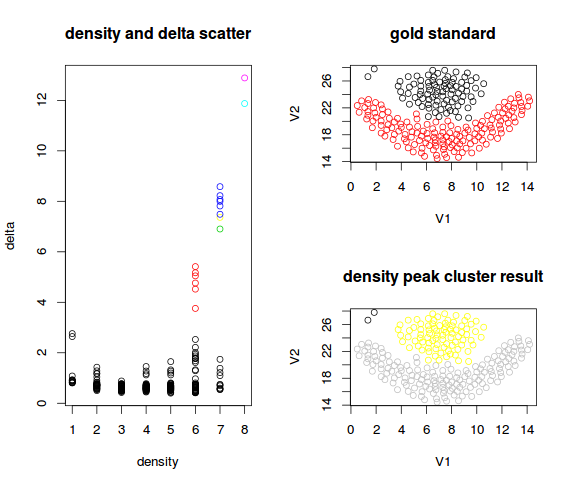
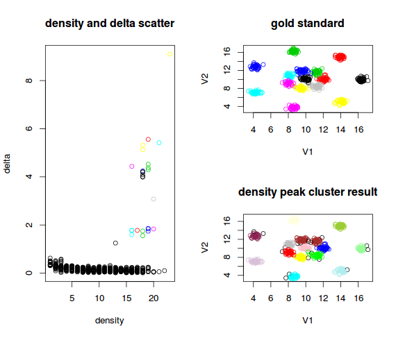
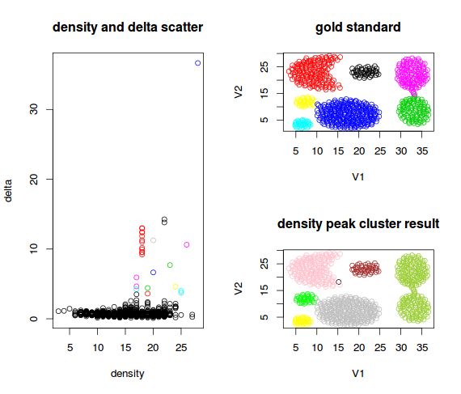

# density-peak-cluster

An R implementation of the paper "Clustering by fast search and 
find of density peaks" in Science Magazine 2014.

## How to experiment

First, you need to install R programming environment. Follow the
instruction of the offical [site](cran).

Then, in the project directory, you can type R to start an R 
interpreter. Type in the following command to load the program.
```
> source("./density-peak-cluster.r")
```

In the *dataset-test* directory, there are some data sets to 
use. You can just use the `run` function to experiment. For
example the following command will use the `spirtal.txt`
dataset.
```
> run("./dataset-test/spirtal.txt")
```

It will generate an image output of the result. The left part
is the scatter plot of the density and delta described in the
paper, and the top-right part is the gold standard, and the 
bottom-right part is the result of the algorithm.

## Some results

spirtal result


flame result


r15 result


aggregation result


For some tests, it try to combine to weakly connect components
in the dataset. I will try to find better way to solve the
problem. Any suggestion or improvement of the code are welcome.

For more details about the algorithm, please refer to [paper](paper)
itself.

## License

This is an open source software distributed under the BSD license.


[cran]: http://cran.r-project.org/
[paper]: http://www.sciencemag.org/content/344/6191/1492.abstract
